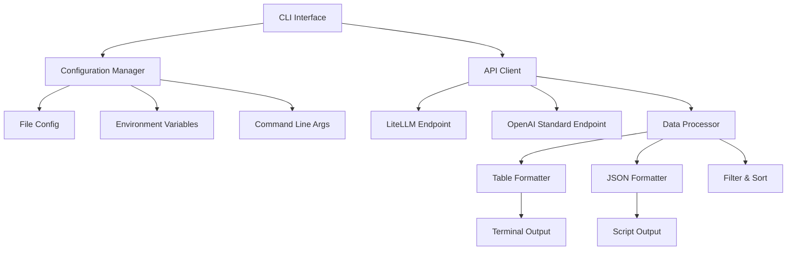

# LLMゲートウェイ情報可視化CLIツール 実装ロードマップ

## プロジェクト概要

**プロジェクト名**: llm-info  
**目的**: 開発者がターミナル上からLLMゲートウェイのモデル情報を素早く把握できるCLIツール  
**ターゲットユーザー**: 開発チーム（Go言語経験は浅いが学習意欲が高い）  
**技術スタック**: Go（標準ライブラリ優先、シンプルな実装）

## 開発アプローチ

### 基本方針
1. **MVPファースト**: 1週間でLiteLLM互換モードのみのMVPをリリース
2. **段階的拡張**: MVPリリース後、ユーザーフィードバックを基に機能拡張
3. **シンプルさ重視**: Go言語初心者でも理解できる実装
4. **テスト駆動開発**: t_wadaスタイルのテスト戦略を適用

### 開発プロセス
- **Outside-In開発**: ユーザーインターフェースから開発開始
- **Red-Green-Refactor**: TDDサイクルで品質を保証
- **継続的リファクタリング**: コードの保守性を継続的に改善

## ロードマップ

### Phase 1: MVP開発（1週間）

**目標**: LiteLLM互換モードによる基本的なモデル情報取得と表示

**PBI**: LiteLLM互換モードによるモデル情報取得と表示機能（5ストーリーポイント）

**実装計画**:
- **Day 1-2**: 基本構造
  - プロジェクト構造の設定
  - 基本的なコマンドライン引数処理
  - HTTPクライアントの基本実装

- **Day 3-4**: API通信
  - LiteLLM互換エンドポイントとの通信
  - JSONレスポンスのパース
  - 基本的なエラーハンドリング

- **Day 5-6**: 表示機能
  - テーブル形式での出力
  - 動的な列制御
  - ユーザビリティの改善

- **Day 7**: テストと仕上げ
  - 単体テスト・統合テストの実装
  - ドキュメントの作成
  - リファクタリング

**リリース基準**:
- [ ] LiteLLM互換の`/model/info`エンドポイントからモデル情報を取得できる
- [ ] 取得した情報をテーブル形式で表示できる
- [ ] コマンドライン引数でベースURLとAPIキーを指定できる
- [ ] 適切なタイムアウト処理が実装されている
- [ ] シンプルで分かりやすいエラーメッセージが表示される
- [ ] Go言語のシングルバイナリとしてビルドできる

---

### Phase 2: 基本拡張（1週間、MVPリリース後）

**目標**: 標準互換モードと設定ファイル機能の追加

**PBI**:
1. 標準互換モードと自動フォールバック機能（3ストーリーポイント）
2. 設定ファイルによるゲートウェイ管理機能（3ストーリーポイント）

**実装計画**:
- **Day 1-3**: 標準互換モード
  - OpenAI標準の`/v1/models`エンドポイント対応
  - 自動フォールバック機能の実装
  - フォールバック通知機能

- **Day 4-5**: 設定ファイル機能
  - YAML設定ファイルのパース
  - 複数ゲートウェイの登録と切り替え
  - コマンドライン引数による設定の上書き

- **Day 6-7**: テストと統合
  - 新機能のテスト実装
  - 既存機能との統合テスト
  - ドキュメント更新

---

### Phase 3: 環境対応（1週間）

**目標**: 環境変数サポートとエラーハンドリングの向上

**PBI**:
1. 環境変数による設定機能（2ストーリーポイント）
2. 詳細なエラーメッセージとヘルプ機能（2ストーリーポイント）

**実装計画**:
- **Day 1-2**: 環境変数サポート
  - 環境変数の読み込み処理
  - 設定の優先順位実装
  - 環境変数のバリデーション

- **Day 3-4**: エラーハンドリング向上
  - エラー種別ごとの詳細メッセージ
  - 解決策の提示機能
  - 包括的なヘルプ機能

- **Day 5-7**: テストと仕上げ
  - 新機能のテスト実装
  - エラーシナリオの網羅的テスト
  - ユーザビリティテスト

---

### Phase 4: 高度な機能（1週間）

**目標**: フィルタリング、ソート、JSON出力などの高度な機能

**PBI**: 高度な表示機能（4ストーリーポイント）

**実装計画**:
- **Day 1-3**: フィルタリングとソート
  - モデル名によるフィルタリング
  - 各項目でのソート機能
  - カラムの表示/非表示切り替え

- **Day 4-5**: JSON出力
  - JSON形式での出力機能
  - スクリプト連携を考慮した設計

- **Day 6-7**: テストと最適化
  - 高度な機能のテスト実装
  - パフォーマンス最適化
  - ドキュメント整備

---

## 技術的アーキテクチャ

### システムアーキテクチャ



### プロジェクト構造（最終版）

```
llm-info/
├── cmd/
│   └── llm-info/
│       └── main.go              # エントリーポイント
├── internal/
│   ├── api/
│   │   ├── client.go            # APIクライアント
│   │   ├── endpoints.go         # エンドポイント定義
│   │   └── response.go          # レスポンス処理
│   ├── model/
│   │   └── model.go             # データモデル
│   ├── config/
│   │   ├── manager.go           # 設定マネージャー
│   │   ├── file.go              # ファイル設定
│   │   └── env.go               # 環境変数設定
│   ├── ui/
│   │   ├── table.go             # テーブル表示
│   │   ├── json.go              # JSON出力
│   │   ├── filter.go            # フィルタリング
│   │   └── sort.go              # ソート機能
│   └── error/
│       └── handler.go           # エラーハンドリング
├── pkg/
│   └── config/
│       └── config.go            # 設定構造体
├── configs/
│   └── example.yaml             # 設定ファイル例
├── test/
│   ├── integration/             # 統合テスト
│   └── e2e/                     # E2Eテスト
├── docs/
│   ├── usage.md                 # 使用方法
│   └── development.md           # 開発ガイド
├── go.mod
├── go.sum
├── Makefile                     # ビルドスクリプト
└── README.md
```

### 品質保証戦略

#### テストピラミッド
- **E2Eテスト（10%）**: 実際のゲートウェイを使用したテスト
- **統合テスト（20%）**: コンポーネント間の連携テスト
- **単体テスト（70%）**: 各関数のロジックテスト

#### コード品質
- **カバレッジ目標**: 80%以上
- **リンタ**: `golangci-lint`使用
- **フォーマット**: `gofmt`標準準拠
- **ドキュメント**: `godoc`コメント必須

## リスク管理

### 技術的リスク
1. **API仕様の変更**: 各ゲートウェイのAPI仕様変更に対応する柔軟な設計
2. **パフォーマンス**: 大量のモデル情報処理におけるパフォーマンス確保
3. **互換性**: 様々なゲートウェイとの互換性確保

### 開発リスク
1. **学習コスト**: Go言語初心者による開発の遅延
   - 緩和策: シンプルな実装、ペアプログラミング
2. **スコープクリープ**: 要件の拡大による遅延
   - 緩和策: MVPファースト、段階的アプローチ

## 成功指標

### 技術指標
- [ ] テストカバレッジ80%以上
- [ ] ビルド時間1分以内
- [ ] 実行時間3秒以内（通常のモデル情報取得）

### ユーザー指標
- [ ] MVPリリース後1ヶ月以内にチーム内で50%以上の利用率
- [ ] ユーザーからのフィードバックで4/5以上の評価
- [ ] エラー報告の減少（従来の手動確認と比較）

## 次のステップ

1. **MVP開発の開始**: Phase 1の実装計画に基づき開発を開始
2. **定期的なレビュー**: 週次進捗確認と品質レビュー
3. **ユーザーフィードバック**: MVPリリース後のフィードバック収集
4. **継続的改善**: フィードバックに基づく機能拡張

---

## 付録: 開発環境セットアップ

### 必要なツール
- Go 1.21+
- Git
- テキストエディタ（VS Code推奨）

### 開発環境構築手順
```bash
# プロジェクトのクローン
git clone <repository-url>
cd llm-info

# Goモジュールの初期化
go mod init github.com/your-org/llm-info

# 依存関係のインストール
go mod tidy

# テスト実行
make test

# ビルド
make build
```

### Makefile例
```makefile
.PHONY: build test clean lint

build:
	go build -o bin/llm-info cmd/llm-info/main.go

test:
	go test -v -cover ./...

clean:
	rm -rf bin/

lint:
	golangci-lint run

install:
	go install cmd/llm-info/main.go