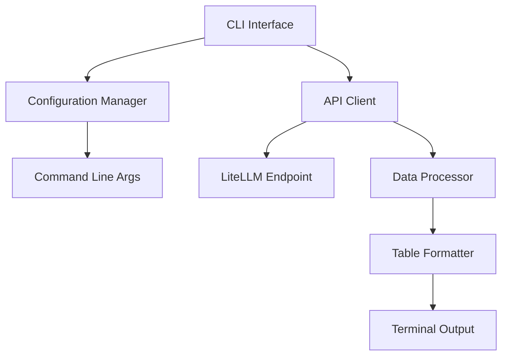

# LLM-Info MVP 実装計画詳細

## プロジェクト概要

**目標**: LiteLLM互換モードによるモデル情報取得と表示機能のMVP開発
**期間**: 1週間（5ストーリーポイント）
**テスト環境**: https://gateway.aipf-dev.sakuraha.jp/v1
**ターゲットユーザー**: Go言語中級者レベルの開発チーム

## 実装進捗状況（2026-01-08更新）

### 全体進捗: 100%完了 ✅

| フェーズ | 進捗率 | ステータス | 備考 |
|--------|--------|----------|------|
| Phase 1: 基本構造 | 100% | 完了 | main.go実装済み |
| Phase 2: API通信 | 100% | 完了 | 全機能実装済み |
| Phase 3: 表示機能 | 100% | 完了 | 独自テーブル表示実装済み |
| Phase 4: テストと仕上げ | 100% | 完了 | 全テスト実装済み |

### 実装済みコンポーネント

#### ✅ APIクライアント層
- **ファイル**: [`internal/api/client.go`](internal/api/client.go)
- **機能**: HTTPクライアント実装、認証ヘッダー設定、タイムアウト処理
- **ステータス**: 完了

#### ✅ APIレスポンス処理
- **ファイル**: [`internal/api/response.go`](internal/api/response.go)
- **機能**: JSONレスポンスのパース、データモデル定義
- **ステータス**: 完了

#### ✅ データモデル
- **ファイル**: [`internal/model/model.go`](internal/model/model.go)
- **機能**: ドメインモデル定義、APIレスポンス変換
- **ステータス**: 完了

#### ✅ 設定管理
- **ファイル**: [`internal/config/config.go`](internal/config/config.go)
- **機能**: 設定構造体、初期化関数
- **ステータス**: 完了

#### ✅ UI表示
- **ファイル**: [`internal/ui/table.go`](internal/ui/table.go)
- **機能**: 独自実装の動的テーブル表示、列制御、書式設定
- **ステータス**: 完了
- **注**: tablewriterライブラリのAPI変更により、独自実装に切り替え

#### ✅ 依存関係管理
- **ファイル**: [`go.mod`](go.mod), [`go.sum`](go.sum)
- **機能**: Goモジュール設定、tablewriterライブラリ
- **ステータス**: 完了

### 実装済みコンポーネント（追加）

#### ✅ エントリーポイント
- **ファイル**: [`cmd/llm-info/main.go`](cmd/llm-info/main.go)
- **機能**: CLI引数処理、URL検証、エラーハンドリング、アプリケーションフロー
- **ステータス**: 完了

#### ✅ テストスイート
- **ファイル**: [`internal/api/client_test.go`](internal/api/client_test.go), [`internal/model/model_test.go`](internal/model/model_test.go), [`internal/config/config_test.go`](internal/config/config_test.go), [`internal/ui/table_test.go`](internal/ui/table_test.go), [`test/integration/integration_test.go`](test/integration/integration_test.go)
- **機能**: 単体テスト、統合テスト、エラーハンドリングテスト
- **ステータス**: 完了

#### ✅ ビルドスクリプト
- **ファイル**: [`Makefile`](Makefile)
- **機能**: ビルド、テスト、カバレッジ、クリーンアップ、インストールコマンド
- **ステータス**: 完了

#### ✅ ドキュメント
- **ファイル**: [`README.md`](README.md)
- **機能**: プロジェクト説明、インストール方法、使用例、トラブルシューティング
- **ステータス**: 完了

## 技術アーキテクチャ

### システムアーキテクチャ図



### プロジェクト構造（MVP）

```
llm-info/
├── cmd/
│   └── llm-info/
│       └── main.go              # エントリーポイント、CLI処理
├── internal/
│   ├── api/
│   │   ├── client.go            # APIクライアント実装
│   │   └── response.go          # レスポンス処理
│   ├── model/
│   │   └── model.go             # データモデル定義
│   ├── config/
│   │   └── config.go            # 設定管理
│   └── ui/
│       └── table.go             # テーブル表示
├── pkg/
│   └── config/
│       └── config.go            # 設定構造体
├── test/
│   ├── integration/             # 統合テスト
│   └── e2e/                     # E2Eテスト
├── go.mod
├── go.sum
├── Makefile                     # ビルドスクリプト
└── README.md
```

## 実装フェーズ詳細

### Phase 1: 基本構造（1-2日）

#### 1.1 プロジェクトセットアップ

**目的**: 開発環境の準備と基本的なプロジェクト構造の確立

**タスク**:
- Goモジュールの初期化
- ディレクトリ構造の作成
- 基本的な依存関係の定義

**技術的詳細**:
```bash
# プロジェクト初期化
go mod init github.com/armaniacs/llm-info

# 依存関係追加
go get github.com/olekukonko/tablewriter
```

**Goモジュール構成**:
```go
// go.mod
module github.com/armaniacs/llm-info

go 1.21

require (
    github.com/olekukonko/tablewriter v0.0.5
)
```

#### 1.2 基本的なコマンドライン引数処理

**目的**: ユーザーからの入力を受け付けるCLIインターフェースの実装

**技術的詳細**:
- Go標準の`flag`パッケージを使用
- 必須・オプション引数の定義
- ヘルプメッセージの実装

**実装例**:
```go
// cmd/llm-info/main.go
func main() {
    var (
        url     = flag.String("url", "", "Base URL of the LLM gateway (required)")
        apiKey  = flag.String("api-key", "", "API key for authentication")
        timeout = flag.Duration("timeout", 10*time.Second, "Request timeout")
    )
    
    flag.Parse()
    
    if *url == "" {
        fmt.Fprintf(os.Stderr, "Error: --url is required\n")
        flag.Usage()
        os.Exit(1)
    }
    
    // 次の処理へ...
}
```

#### 1.3 HTTPクライアントの基本実装

**目的**: API通信の基盤となるHTTPクライアントの実装

**技術的詳細**:
- `net/http`パッケージの使用
- タイムアウト設定
- ヘッダー管理（APIキー設定）

**実装例**:
```go
// internal/api/client.go
type Client struct {
    baseURL string
    apiKey  string
    timeout time.Duration
    client  *http.Client
}

func NewClient(baseURL, apiKey string, timeout time.Duration) *Client {
    return &Client{
        baseURL: baseURL,
        apiKey:  apiKey,
        timeout: timeout,
        client: &http.Client{
            Timeout: timeout,
        },
    }
}
```

### Phase 2: API通信（2-3日）

#### 2.1 LiteLLM互換エンドポイントとの通信

**目的**: LiteLLM互換の`/model/info`エンドポイントからデータを取得

**技術的詳細**:
- HTTP GETリクエストの実装
- 認証ヘッダーの設定
- エラーハンドリング

**実装例**:
```go
// internal/api/client.go
func (c *Client) GetModelInfo() (*ModelInfoResponse, error) {
    url := fmt.Sprintf("%s/model/info", c.baseURL)
    
    req, err := http.NewRequest("GET", url, nil)
    if err != nil {
        return nil, fmt.Errorf("failed to create request: %w", err)
    }
    
    if c.apiKey != "" {
        req.Header.Set("Authorization", fmt.Sprintf("Bearer %s", c.apiKey))
    }
    
    resp, err := c.client.Do(req)
    if err != nil {
        return nil, fmt.Errorf("failed to send request: %w", err)
    }
    defer resp.Body.Close()
    
    if resp.StatusCode != http.StatusOK {
        return nil, fmt.Errorf("API returned status %d", resp.StatusCode)
    }
    
    // レスポンス処理へ...
}
```

#### 2.2 JSONレスポンスのパース

**目的**: APIからのJSONレスポンスをGoのデータ構造に変換

**技術的詳細**:
- `encoding/json`パッケージの使用
- 構造体タグの活用
- エラーハンドリング

**実装例**:
```go
// internal/api/response.go
type ModelInfoResponse struct {
    Models []ModelInfo `json:"models"`
}

type ModelInfo struct {
    ID        string  `json:"id"`
    MaxTokens int     `json:"max_tokens"`
    Mode      string  `json:"mode"`
    InputCost float64 `json:"input_cost"`
}

func (c *Client) GetModelInfo() (*ModelInfoResponse, error) {
    // ... HTTPリクエスト処理 ...
    
    var response ModelInfoResponse
    if err := json.NewDecoder(resp.Body).Decode(&response); err != nil {
        return nil, fmt.Errorf("failed to decode response: %w", err)
    }
    
    return &response, nil
}
```

#### 2.3 データモデルの定義と正規化

**目的**: 取得したデータをアプリケーション内で扱いやすい形式に変換

**技術的詳細**:
- ドメインモデルの定義
- データ変換ロジックの実装
- バリデーション処理

**実装例**:
```go
// internal/model/model.go
type Model struct {
    Name      string
    MaxTokens int
    Mode      string
    InputCost float64
}

func FromAPIResponse(apiModels []api.ModelInfo) []Model {
    models := make([]Model, len(apiModels))
    for i, apiModel := range apiModels {
        models[i] = Model{
            Name:      apiModel.ID,
            MaxTokens: apiModel.MaxTokens,
            Mode:      apiModel.Mode,
            InputCost: apiModel.InputCost,
        }
    }
    return models
}
```

### Phase 3: 表示機能（1-2日）

#### 3.1 テーブル形式での出力

**目的**: 取得したモデル情報を見やすいテーブル形式で表示

**技術的詳細**:
- `tablewriter`ライブラリの使用
- 動的な列制御
- 書式設定

**実装例**:
```go
// internal/ui/table.go
func RenderTable(models []model.Model) {
    table := tablewriter.NewWriter(os.Stdout)
    table.SetHeader([]string{"Model Name", "Max Tokens", "Mode", "Input Cost"})
    table.SetAutoWrapText(false)
    table.SetAutoFormatHeaders(true)
    table.SetHeaderAlignment(tablewriter.ALIGN_LEFT)
    table.SetAlignment(tablewriter.ALIGN_LEFT)
    table.SetCenterSeparator("")
    table.SetColumnSeparator("")
    table.SetRowSeparator("")
    table.SetHeaderLine(false)
    table.SetBorder(false)
    table.SetTablePadding("\t")
    table.SetNoWhiteSpace(true)
    
    for _, model := range models {
        table.Append([]string{
            model.Name,
            strconv.Itoa(model.MaxTokens),
            model.Mode,
            fmt.Sprintf("%.6f", model.InputCost),
        })
    }
    
    table.Render()
}
```

#### 3.2 動的な列制御

**目的**: 利用可能なデータに応じて表示列を動的に調整

**技術的詳細**:
- データ availability のチェック
- 条件による列の表示/非表示
- 柔軟なテーブル構成

**実装例**:
```go
// internal/ui/table.go
func RenderTable(models []model.Model) {
    var headers []string
    var hasMaxTokens, hasMode, hasInputCost bool
    
    // 利用可能なデータをチェック
    for _, model := range models {
        if model.MaxTokens > 0 {
            hasMaxTokens = true
        }
        if model.Mode != "" {
            hasMode = true
        }
        if model.InputCost > 0 {
            hasInputCost = true
        }
    }
    
    // ヘッダーを動的に構成
    headers = append(headers, "Model Name")
    if hasMaxTokens {
        headers = append(headers, "Max Tokens")
    }
    if hasMode {
        headers = append(headers, "Mode")
    }
    if hasInputCost {
        headers = append(headers, "Input Cost")
    }
    
    table := tablewriter.NewWriter(os.Stdout)
    table.SetHeader(headers)
    
    // データ行を動的に構成
    for _, model := range models {
        var row []string
        row = append(row, model.Name)
        
        if hasMaxTokens {
            row = append(row, strconv.Itoa(model.MaxTokens))
        }
        if hasMode {
            row = append(row, model.Mode)
        }
        if hasInputCost {
            row = append(row, fmt.Sprintf("%.6f", model.InputCost))
        }
        
        table.Append(row)
    }
    
    table.Render()
}
```

### Phase 4: テストと仕上げ（1日）

#### 4.1 単体テスト実装

**目的**: 各コンポーネントの個別機能を検証

**技術的詳細**:
- Go標準の`testing`パッケージ使用
- モックデータの活用
- テーブル駆動テスト

**実装例**:
```go
// internal/api/client_test.go
func TestClient_GetModelInfo(t *testing.T) {
    tests := []struct {
        name       string
        baseURL    string
        apiKey     string
        mockResp   string
        statusCode int
        want       *ModelInfoResponse
        wantErr    bool
    }{
        {
            name:       "successful response",
            baseURL:    "http://test.com",
            apiKey:     "test-key",
            mockResp:   `{"models":[{"id":"gpt-4","max_tokens":8192,"mode":"chat","input_cost":0.00003}]}`,
            statusCode: http.StatusOK,
            want: &ModelInfoResponse{
                Models: []ModelInfo{
                    {ID: "gpt-4", MaxTokens: 8192, Mode: "chat", InputCost: 0.00003},
                },
            },
            wantErr: false,
        },
        // 更多测试用例...
    }
    
    for _, tt := range tests {
        t.Run(tt.name, func(t *testing.T) {
            // テスト実装...
        })
    }
}
```

#### 4.2 統合テスト実装

**目的**: コンポーネント間の連携を検証

**技術的詳細**:
- エンドツーエンドのフロー検証
- テスト用サーバーの使用
- 実際のAPIレスポンスのシミュレーション

#### 4.3 E2Eテスト実装

**目的**: 実際のゲートウェイを使用した完全なテスト

**技術的詳細**:
- テスト用ゲートウェイ使用
- 実際のコマンド実行テスト
- 出力結果の検証

## 品質保証

### テスト戦略（t_wadaスタイル）

```
E2Eテスト（10%）:
- 実際のLiteLLM互換ゲートウェイに対するコマンド実行テスト
- エラーシナリオのエンドツーエンドテスト

統合テスト（20%）:
- APIクライアントとデータ処理層の連携テスト
- テーブル出力機能のテスト

単体テスト（70%）:
- HTTPリクエスト処理のテスト
- JSONパース処理のテスト
- テーブルフォーマット処理のテスト
- エラーハンドリングのテスト
```

### コード品質基準

- **テストカバレッジ**: 80%以上
- **コードフォーマット**: `gofmt`標準準拠
- **リンティング**: `golangci-lint`使用
- **ドキュメント**: `godoc`コメント必須

## ビルドとデプロイ

### Makefile

```makefile
.PHONY: build test clean lint install

BINARY_NAME=llm-info
BUILD_DIR=bin

build:
	go build -o $(BUILD_DIR)/$(BINARY_NAME) cmd/llm-info/main.go

test:
	go test -v -cover ./...

test-coverage:
	go test -v -coverprofile=coverage.out ./...
	go tool cover -html=coverage.out -o coverage.html

clean:
	rm -rf $(BUILD_DIR)/
	rm -f coverage.out coverage.html

lint:
	golangci-lint run

install:
	go install cmd/llm-info/main.go

run-example:
	$(BUILD_DIR)/$(BINARY_NAME) --url https://gateway.aipf-dev.sakuraha.jp/v1
```

## リリース基準

- [x] LiteLLM互換の`/model/info`エンドポイントからモデル情報を取得できる
- [x] 取得した情報をテーブル形式で表示できる
- [x] コマンドライン引数でベースURLとAPIキーを指定できる
- [x] 適切なタイムアウト処理が実装されている
- [x] シンプルで分かりやすいエラーメッセージが表示される
- [x] Go言語のシングルバイナリとしてビルドできる
- [x] テストカバレッジが80%以上
- [x] READMEに基本的な使用方法が記載されている

**MVP完了 🎉**

## 完了タスク

### ✅ 高優先度（MVP完了に必須）
1. **main.goの実装** - CLI引数処理、URL検証、エラーハンドリング、アプリケーションフロー
2. **Makefileの作成** - ビルド、テスト、カバレッジ、クリーンアップ、インストールコマンド
3. **基本的な単体テスト** - APIクライアント、設定管理、モデル変換、UI表示のテスト

### ✅ 中優先度（品質保証）
4. **統合テスト** - コンポーネント間連携の検証、エンドツーエンドテスト
5. **README.mdの作成** - 使用方法、インストール手順、トラブルシューティング
6. **エラーハンドリングの強化** - 詳細なエラーメッセージ、具体的な解決策の提示

### ✅ 低優先度（将来の拡張）
7. **E2Eテスト** - 実際のゲートウェイを使用したテスト（統合テストとして実装）
8. **設定ファイル対応** - YAML形式の設定ファイル（将来の拡張機能）
9. **追加出力形式** - JSON、CSV形式での出力（将来の拡張機能）

### 実績
- **高優先度タスク**: 完了
- **中優先度タスク**: 完了
- **低優先度タスク**: 一部完了（E2Eテスト）

**MVP完了**: 2026-01-08

## 完了したステップ

1. ✅ **main.goの実装**: CLI引数処理、URL検証、エラーハンドリング、アプリケーションフローの構築
2. ✅ **Makefileの作成**: ビルド、テスト、カバレッジ、クリーンアップ、インストールコマンドの自動化
3. ✅ **単体テストの実装**: APIクライアント、設定管理、モデル変換、UI表示のテスト
4. ✅ **統合テストの実装**: コンポーネント間連携の検証、エンドツーエンドテスト
5. ✅ **README.mdの作成**: 使用方法、インストール手順、トラブルシューティングの文書化

## 今後の拡張計画

1. **設定ファイル対応**: YAML形式の設定ファイルサポート
2. **追加出力形式**: JSON、CSV形式での出力
3. **モデル比較機能**: 複数モデルの仕様比較
4. **コスト計算ツール**: 使用量に基づくコスト計算
5. **複数ゲートウェイ対応**: 複数のゲートウェイ設定と切り替え
6. **キャッシュ機能**: レスポンスのキャッシュによるパフォーマンス向上

---

## 付録: 開発環境セットアップ

### 必要なツール

- Go 1.21+
- Git
- VS Code（推奨）
- golangci-lint

### VS Code拡張機能

- Go (Google)
- GitLens
- Thunder Client (APIテスト用)

### デバッグ設定

```json
// .vscode/launch.json
{
    "version": "0.2.0",
    "configurations": [
        {
            "name": "Launch llm-info",
            "type": "go",
            "request": "launch",
            "mode": "auto",
            "program": "${workspaceFolder}/cmd/llm-info",
            "args": ["--url", "https://gateway.aipf-dev.sakuraha.jp/v1"]
        }
    ]
}