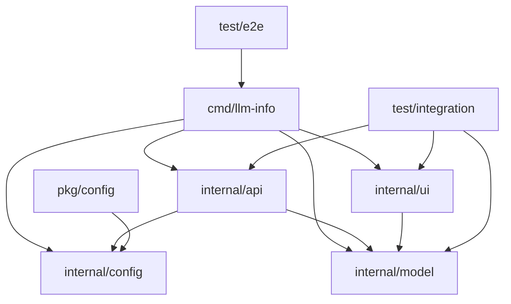

# LLM-Info プロジェクト構成詳細ガイド

## Goプロジェクト構成のベストプラクティス

### ディレクトリ構成の原則

Goプロジェクトでは、以下の原則に基づいてディレクトリ構成を設計します：

1. **明確な責務分離**: 各パッケージが単一の責務を持つ
2. **依存関係の方向**: 依存は内側に向かう（internalパッケージの活用）
3. **再利用性**: `pkg`パッケージで外部に公開するコードを管理
4. **テストの組織**: テストコードの適切な配置

## 詳細ディレクトリ構成

```
llm-info/
├── cmd/                          # アプリケーションのエントリーポイント
│   └── llm-info/                 # メインCLIアプリケーション
│       └── main.go               # エントリーポイント、CLI処理
│
├── internal/                     # 内部パッケージ（外部から非公開）
│   ├── api/                      # API通信層
│   │   ├── client.go             # APIクライアント実装
│   │   ├── client_test.go        # APIクライアントのテスト
│   │   └── response.go           # APIレスポンス構造体
│   │
│   ├── model/                    # ドメインモデル
│   │   ├── model.go              # データモデル定義
│   │   └── model_test.go         # データモデルのテスト
│   │
│   ├── config/                   # 設定管理
│   │   ├── config.go             # 設定構造体と管理
│   │   └── config_test.go        # 設定管理のテスト
│   │
│   └── ui/                       # ユーザーインターフェース
│       ├── table.go              # テーブル表示機能
│       ├── table_test.go         # テーブル表示のテスト
│       └── formatter.go          # 出力フォーマット処理
│
├── pkg/                          # 外部に公開するパッケージ
│   └── config/                   # 設定関連の公開API
│       └── config.go             # 設定構造体の定義
│
├── test/                         # 統合・E2Eテスト
│   ├── integration/              # 統合テスト
│   │   ├── api_test.go           # API統合テスト
│   │   └── ui_test.go            # UI統合テスト
│   │
│   ├── e2e/                      # エンドツーエンドテスト
│   │   ├── cli_test.go           # CLIのE2Eテスト
│   │   └── testdata/             # テストデータ
│   │       └── mock_responses/   # モックAPIレスポンス
│   │
│   └── testutil/                 # テストユーティリティ
│       ├── mock_server.go        # モックサーバー
│       └── helpers.go            # テストヘルパー関数
│
├── docs/                         # ドキュメント
│   ├── api.md                    # APIドキュメント
│   ├── development.md            # 開発ガイド
│   └── usage.md                  # 使用方法
│
├── configs/                      # 設定ファイル例
│   └── example.yaml              # 設定ファイルのテンプレート
│
├── scripts/                      # ビルド・デプロイスクリプト
│   ├── build.sh                  # ビルドスクリプト
│   └── test.sh                   # テスト実行スクリプト
│
├── .github/                      # GitHub関連設定
│   └── workflows/                # GitHub Actions
│       ├── ci.yml                # CIパイプライン
│       └── release.yml           # リリースパイプライン
│
├── .vscode/                      # VS Code設定
│   ├── launch.json               # デバッグ設定
│   ├── settings.json             # エディタ設定
│   └── tasks.json                # タスク設定
│
├── go.mod                        # Goモジュール定義
├── go.sum                        # 依存関係のチェックサム
├── Makefile                      # ビルドスクリプト
├── README.md                     # プロジェクト説明
├── LICENSE                       # ライセンス
├── .gitignore                    # Git無視ファイル
└── .golangci.yml                 # リンター設定
```

## 各ディレクトリの詳細説明

### 1. `cmd/` ディレクトリ

**目的**: アプリケーションのエントリーポイントを管理

**内容**:
- `main.go`: プログラムの開始点、コマンドライン引数処理
- 各アプリケーションごとにサブディレクトリを作成

**設計原則**:
- エントリーポイントは最小限に保つ
- ビジネスロジックは`internal`パッケージに委譲
- 依存関係の注入を行う

**例**:
```go
// cmd/llm-info/main.go
package main

import (
    "os"
    
    "github.com/armaniacs/llm-info/internal/api"
    "github.com/armaniacs/llm-info/internal/config"
    "github.com/armaniacs/llm-info/internal/ui"
)

func main() {
    // 設定の読み込み
    cfg := config.LoadFromArgs()
    
    // 依存関係の注入
    client := api.NewClient(cfg)
    renderer := ui.NewTableRenderer()
    
    // アプリケーションの実行
    app := NewApp(cfg, client, renderer)
    if err := app.Run(); err != nil {
        os.Exit(1)
    }
}
```

### 2. `internal/` ディレクトリ

**目的**: 外部に公開しない内部パッケージを管理

**特徴**:
- `internal`ディレクトリ以下のパッケージは、親ディレクトリからのみインポート可能
- 内部実装の詳細を隠蔽できる
- 将来的なAPI変更の影響を限定できる

#### 2.1 `internal/api/` パッケージ

**責務**: 外部APIとの通信

**構成要素**:
- `client.go`: HTTPクライアントの実装
- `response.go`: APIレスポンスの構造体定義
- `endpoint.go`: APIエンドポイントの定義

**設計原則**:
- インターフェースを定義してテスト容易性を確保
- エラーハンドリングを統一
- 設定に依存しない設計

#### 2.2 `internal/model/` パッケージ

**責務**: ドメインモデルの定義と変換

**構成要素**:
- `model.go`: ビジネスエンティティの定義
- `converter.go`: データ変換ロジック

**設計原則**:
- ドメインロジックをカプセル化
- 外部APIの構造に依存しない
- バリデーションロジックを含む

#### 2.3 `internal/config/` パッケージ

**責務**: アプリケーション設定の管理

**構成要素**:
- `config.go`: 設定構造体と読み込みロジック
- `loader.go`: 各種設定ソースからの読み込み

**設計原則**:
- 設定ソースの抽象化
- デフォルト値の提供
- バリデーション機能

#### 2.4 `internal/ui/` パッケージ

**責務**: ユーザーインターフェースの実装

**構成要素**:
- `table.go`: テーブル表示機能
- `formatter.go`: 出力フォーマット処理
- `color.go`: カラー表示機能

**設計原則**:
- 表示ロジックの分離
- 拡張可能なフォーマット設計
- ユーザビリティの考慮

### 3. `pkg/` ディレクトリ

**目的**: 外部に公開する再利用可能なパッケージを管理

**特徴**:
- 他のプロジェクトからインポート可能
- 安定したAPIを提供
- バージョニングの対象

**使用例**:
```go
// 他のプロジェクトからの使用
import "github.com/armaniacs/llm-info/pkg/config"

cfg := config.NewDefault()
```

### 4. `test/` ディレクトリ

**目的**: 統合テストとE2Eテストを管理

**構成**:
- `integration/`: コンポーネント間の連携テスト
- `e2e/`: エンドツーエンドの機能テスト
- `testutil/`: テストユーティリティとモック

**設計原則**:
- 本番コードと分離
- 再利用可能なテストユーティリティ
- 現実的なテストシナリオ

## パッケージ間の依存関係



## 依存関係のルール

1. **上から下へ**: 上位レイヤーが下位レイヤーに依存
2. **循環の禁止**: パッケージ間の循環依存を避ける
3. **インターフェースの活用**: 具体的な実装ではなくインターフェースに依存

## テストコードの配置

### 単体テスト

**配置**: テスト対象ファイルと同じディレクトリ

**例**:
```
internal/api/
├── client.go
└── client_test.go
```

### 統合テスト

**配置**: `test/integration/` ディレクトリ

**例**:
```
test/integration/
├── api_test.go
└── ui_test.go
```

### E2Eテスト

**配置**: `test/e2e/` ディレクトリ

**例**:
```
test/e2e/
├── cli_test.go
└── testdata/
    └── mock_responses/
        └── success.json
```

## 設定ファイルの管理

### 開発環境設定

**ファイル**: `.vscode/settings.json`

```json
{
    "go.toolsManagement.checkForUpdates": "local",
    "go.useLanguageServer": true,
    "go.gopath": "",
    "go.goroot": "",
    "go.formatTool": "goimports",
    "go.lintTool": "golangci-lint",
    "go.testFlags": ["-v"],
    "go.coverOnSave": true,
    "go.coverageDecorator": {
        "type": "gutter",
        "coveredHighlightColor": "rgba(64,128,64,0.5)",
        "uncoveredHighlightColor": "rgba(128,64,64,0.25)"
    }
}
```

### デバッグ設定

**ファイル**: `.vscode/launch.json`

```json
{
    "version": "0.2.0",
    "configurations": [
        {
            "name": "Launch llm-info",
            "type": "go",
            "request": "launch",
            "mode": "auto",
            "program": "${workspaceFolder}/cmd/llm-info",
            "args": ["--url", "https://gateway.aipf-dev.sakuraha.jp/v1"],
            "env": {
                "LLM_INFO_API_KEY": "test-key"
            }
        },
        {
            "name": "Launch Tests",
            "type": "go",
            "request": "launch",
            "mode": "test",
            "program": "${workspaceFolder}"
        }
    ]
}
```

## ビルド設定

### Makefile

```makefile
.PHONY: build test clean lint install

# 変数定義
BINARY_NAME=llm-info
BUILD_DIR=bin
VERSION=$(shell git describe --tags --always --dirty)
LDFLAGS=-ldflags "-X main.version=$(VERSION)"

# ビルド
build:
	go build $(LDFLAGS) -o $(BUILD_DIR)/$(BINARY_NAME) cmd/llm-info/main.go

# クロスコンパイル
build-all:
	GOOS=linux GOARCH=amd64 go build $(LDFLAGS) -o $(BUILD_DIR)/$(BINARY_NAME)-linux-amd64 cmd/llm-info/main.go
	GOOS=darwin GOARCH=amd64 go build $(LDFLAGS) -o $(BUILD_DIR)/$(BINARY_NAME)-darwin-amd64 cmd/llm-info/main.go
	GOOS=windows GOARCH=amd64 go build $(LDFLAGS) -o $(BUILD_DIR)/$(BINARY_NAME)-windows-amd64.exe cmd/llm-info/main.go

# テスト
test:
	go test -v -race -cover ./...

test-integration:
	go test -v -race -tags=integration ./test/integration/...

test-e2e:
	go test -v -tags=e2e ./test/e2e/...

# コード品質
lint:
	golangci-lint run

fmt:
	goimports -w .

# クリーンアップ
clean:
	rm -rf $(BUILD_DIR)/
	rm -f coverage.out coverage.html

# インストール
install:
	go install $(LDFLAGS) cmd/llm-info/main.go

# 開発用
dev:
	go run cmd/llm-info/main.go --url https://gateway.aipf-dev.sakuraha.jp/v1

# ヘルプ
help:
	@echo "Available targets:"
	@echo "  build          - Build the binary"
	@echo "  build-all      - Build for all platforms"
	@echo "  test           - Run unit tests"
	@echo "  test-integration - Run integration tests"
	@echo "  test-e2e       - Run E2E tests"
	@echo "  lint           - Run linter"
	@echo "  fmt            - Format code"
	@echo "  clean          - Clean build artifacts"
	@echo "  install        - Install to GOPATH/bin"
	@echo "  dev            - Run in development mode"
	@echo "  help           - Show this help"
```

## この構成の利点

1. **スケーラビリティ**: 機能追加時の影響範囲が明確
2. **テスタビリティ**: 各コンポーネントの独立テストが容易
3. **保守性**: 責務分離によりコードの理解が容易
4. **再利用性**: `pkg`パッケージによるコード共有
5. **拡張性**: 新機能の追加が既存コードに影響しにくい

## 次のステップ

1. **プロジェクト初期化**: この構造でディレクトリを作成
2. **Goモジュール設定**: `go.mod`ファイルの作成
3. **依存関係管理**: 必要なライブラリの追加
4. **開発環境設定**: VS Codeやツールの設定
5. **実装開始**: Phase 1から開発を開始

---

## 付録: Goプロジェクト構成の参考資料

- [Standard Go Project Layout](https://github.com/golang-standards/project-layout)
- [Go Code Organization](https://blog.golang.org/organizing-go-code)
- [Go Package Names](https://blog.golang.org/package-names)